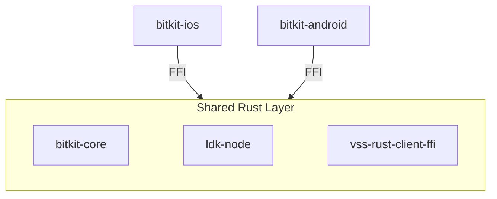

# Bitkit

This repository is the umbrella index for Bitkit. It explains the architecture and points to the production repositories for the native apps and core dependencies.

## Overview

Bitkit ships as native iOS and Android apps that share a Rust core via FFI. This repo is intentionally lightweight; build and development instructions live in the app and core repos.

## Architecture

## Related repos

- [synonymdev/bitkit-android](https://github.com/synonymdev/bitkit-android) - Native Android app (Compose).
- [synonymdev/bitkit-ios](https://github.com/synonymdev/bitkit-ios) - Native iOS app (SwiftUI).
- [synonymdev/bitkit-core](https://github.com/synonymdev/bitkit-core) - Rust core library with FFI bindings for iOS and Android.
- [synonymdev/vss-rust-client-ffi](https://github.com/synonymdev/vss-rust-client-ffi) - VSS client FFI bindings for mobile apps.
- [synonymdev/ldk-node](https://github.com/synonymdev/ldk-node) - Lightning node library dependency.

## Deprecated/Archived

- [synonymdev/bitkit-react-native](https://github.com/synonymdev/bitkit-react-native) - Archived legacy React Native app (in use before 2026). New development happens in the native apps above.

## Where to start

- Android app: [bitkit-android/README](https://github.com/synonymdev/bitkit-android/blob/master/README.md)
- iOS app: [bitkit-ios/README](https://github.com/synonymdev/bitkit-ios/blob/master/README.md)
- Core library: [bitkit-core/README](https://github.com/synonymdev/bitkit-core/blob/master/README.md)
- VSS client: [vss-rust-client-ffi/README](https://github.com/synonymdev/vss-rust-client-ffi/blob/master/README.md)
- LDK Node: [ldk-node/README](https://github.com/synonymdev/ldk-node/blob/main/README.md)

## License

This project is licensed under the MIT License.
See the [LICENSE](./LICENSE) file for more details.
